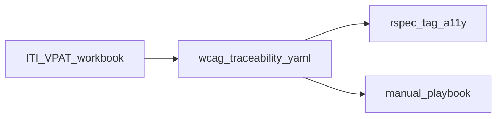

# Hyku — accessibility, VPAT, and WCAG 2.1 AA

Hyku supports a **VPAT-oriented** conformance workflow: the ITI workbook, a WCAG 2.1 A/AA traceability matrix ([`wcag-2.1-aa-traceability-matrix.yaml`](./wcag-2.1-aa-traceability-matrix.yaml)), automated **axe-core** runs on selected user journeys in RSpec, and the **manual release playbook** (keyboard, zoom, assistive technology) below.

**Contents:** [Workflow](#workflow) · [Quick commands](#quick-commands) · [VPAT draft](#vpat-product-information-draft) · [Traceability](#traceability) · [Axe testing](#automated-axe-testing) · [Docker](#running-specs-in-docker) · [Manual playbook](#manual-release-playbook) · [Third-party](#third-party-components-and-vpat-scope) · [CI artifacts](#ci-artifacts-and-isolated-jobs) · [Pa11y](#pa11y--site-wide-scan-operators) · [5→7 regression](#hyku-5--71-regression-focus) · [Artifacts env](#artifacts-a11y_artifacts)

## Workflow



1. Use the [ITI VPAT](https://www.itic.org/policy/accessibility/vpat) (e.g. VPAT 2.5 for WCAG 2.1) with the **product information** and **evaluation methods** below.
2. Map criteria and evidence in [`wcag-2.1-aa-traceability-matrix.yaml`](./wcag-2.1-aa-traceability-matrix.yaml).
3. Run **`bin/rspec-a11y`** (axe on critical paths); optionally archive **`tmp/a11y/`**.
4. Run the **manual release playbook** for what axe does not cover.

## Quick commands

```bash
docker compose exec web bin/rspec-a11y
# optional VPAT artifacts:
docker compose exec -e A11Y_ARTIFACTS=1 web bin/rspec-a11y
```

Specs: [`spec/features/accessibility/critical_paths_accessibility_spec.rb`](../../spec/features/accessibility/critical_paths_accessibility_spec.rb), [`spec/features/accessibility/extended_paths_accessibility_spec.rb`](../../spec/features/accessibility/extended_paths_accessibility_spec.rb). Helper: [`spec/support/accessibility_helpers.rb`](../../spec/support/accessibility_helpers.rb).

After changing **public-facing UI** (`app/assets/stylesheets/`, shared views, appearance templates), run the command above before merging (see [.github/CONTRIBUTING.md](../../.github/CONTRIBUTING.md)).

---

## VPAT product information (draft)

This is **not** a completed VPAT. Paste into the ITI workbook; legal/procurement should review.

### Conformance target

| Item | Value |
|------|--------|
| **WCAG** | 2.1 Level **A** and **AA** |
| **Revised Section 508** | Chapter 3 (electronic content), per VPAT tables |
| **EN 301 549** | Only if procurement requires it |

### Product fields

| Field | Suggested content |
|-------|-------------------|
| **Product name** | Hyku (Hydra-in-a-Box) |
| **Product version** | Release tag or commit (`git describe` / deployment manifest) |
| **Vendor / developer** | Your organization |
| **Contact for accessibility** | Name, email, phone |
| **Last updated** | Evaluation date |
| **Notes on scope** | Rails + Hyrax + Blacklight. Some surfaces are third-party or upstream (Universal Viewer, pdf.js). Describe what **your deployment** exposes—not every optional component. |

### Evaluation methods (summary)

1. **Automated**: [axe-core](https://github.com/dequelabs/axe-core) via `axe-core-rspec` on selected journeys (same specs as above). Requires **full stack + `chrome` service** in Docker/CI.
2. **Manual**: Release checklist below (keyboard, zoom, AT).
3. **Environment**: Document browsers, OS, build/staging URL, and AT used (e.g. NVDA, VoiceOver).

### Continuous integration

- **GitHub**: `build-test-lint` runs full RSpec (including `:a11y`).
- **GitLab**: The `test` job runs the same style of suite unless RSpec is tag-filtered.

### Baseline contrast remediation (Hyku default theme)

| Area | File | Change |
|------|------|--------|
| Splash feature headings on `#f4f4f4` | [`app/assets/stylesheets/hyku/splash.scss`](../../app/assets/stylesheets/hyku/splash.scss) | `.product-features .heading` uses `$jumbotron-heading-color` instead of `$gray`. |
| Breadcrumb links vs appearance link color on `#e9ecef` | [`app/assets/stylesheets/hyku.scss`](../../app/assets/stylesheets/hyku.scss) | `body.public-facing .breadcrumb a` uses darker colors than default `#2e74b2`. |

Tenants that customize **Appearance → link color** should still verify contrast on breadcrumbs and muted backgrounds.

**Note:** OER metadata fields named “accessibility” (`accessibilityFeature`, etc.) describe **content**, not software conformance. They are unrelated to the product VPAT.

---

## Traceability

Full WCAG 2.1 A/AA list, coverage type (`automated_axe` | `semi_automated` | `manual`), evidence notes, and spec references: [`wcag-2.1-aa-traceability-matrix.yaml`](./wcag-2.1-aa-traceability-matrix.yaml). Align workbook rows with **ITI VPAT 2.5** (or newer for WCAG 2.1).

---

## Automated axe testing

- **Tags**: `wcag2a`, `wcag2aa`, `wcag21aa` (see [`spec/support/accessibility_helpers.rb`](../../spec/support/accessibility_helpers.rb)).
- **Primary scan region**: `#content-wrapper` on each `:a11y` path.
- **Not fully covered in one scan**: Universal Viewer iframe, full pdf.js surface, some global chrome; embedded iframes may need separate manual review.
- **Exclusions**: Add `.excluding(...)` in specs only for documented third-party noise; document selector, rationale, and VPAT note in your internal change log or matrix notes if you add one:

```ruby
expect(page).to be_axe_clean
  .according_to(*HykuAccessibility::AxeConfiguration::TAGS)
  .within('#content-wrapper')
  .excluding('#uv-embed') # example only — not enabled by default
```

**Modals / live regions:** Deposit wizard dialogs, share/embargo modals, Bulkrax or plugin overlays—validate manually (playbook below), not only with axe.

**Tenant themes:** Colors from Admin → Appearance ([`app/views/shared/_appearance_styles.html.erb`](../../app/views/shared/_appearance_styles.html.erb)). Fix or document `color-contrast` exceptions per tenant.

---

## Running specs in Docker

Axe specs are **`js: true` feature specs**: they need **`web`**, **`chrome`**, and the usual dependencies (Solr, Fedora if enabled, Postgres, Redis, ZooKeeper). [`.env`](../../.env) should set `IN_DOCKER=true` and `CHROME_HOSTNAME=chrome` (see [`spec/rails_helper.rb`](../../spec/rails_helper.rb)).

1. **Build** after Gem changes: `docker compose build web`
2. **Start stack**: `docker compose up web` (wait for app on `:3000`; `-d` optional)
3. **Bundle in container** (bind mount): `docker compose exec web bundle install`
4. **Run**: `docker compose exec web bin/rspec-a11y` (or `bundle exec rspec --tag a11y`)

**Troubleshooting:** Confirm `chrome` is up (`docker compose ps`). For multitenant host issues, align with [getting started](../getting-started.md) / `localhost.direct`. On failure, Capybara may save HTML (`save_page` in `rails_helper`); with `A11Y_ARTIFACTS=1`, also check `tmp/a11y/`.

---

## Manual release playbook

Run after automated checks pass. **Time box:** ~60–120 minutes per major release for criteria the matrix marks manual or semi-automated. Use at least one Chromium browser and Firefox or Safari; NVDA and/or VoiceOver for spot checks. Prefer staging and a non-production account.

### Checklist ↔ WCAG (quick map)

| Section | Primary WCAG | Matrix coverage |
|---------|----------------|-----------------|
| Keyboard | 2.1.1, 2.1.2, 2.4.3, 2.4.7 | Often manual / semi |
| Zoom and reflow | 1.4.4, 1.4.10 | Manual |
| Text spacing | 1.4.12 | Manual |
| Forms and errors | 3.3.1, 3.3.2 | Semi / manual |
| Media / time | 1.2.x | Manual (content-heavy) |
| Third-party viewers | 2.1.x, 1.1.1, 4.1.2 (context) | Manual + VPAT exceptions |
| Screen reader | 4.1.2, 4.1.3 | Manual |
| Hover / focus content | 1.4.13 | Manual |

### 1. Keyboard (2.1.1, 2.1.2, 2.4.3, 2.4.7)

On splash/home, catalog, public work show, sign-in, dashboard, one deposit step: tab in logical order; no traps; visible focus; Escape closes dialogs where expected; skip link (if any) moves focus to main content.

### 2. Zoom and reflow (1.4.4, 1.4.10)

200% zoom: primary content usable; narrow window (~320 CSS px): nav and main content not unusably overlapped.

### 3. Text spacing (1.4.12)

Larger text / reader modes: headings and controls do not clip on key templates.

### 4. Forms and errors (3.3.1, 3.3.2)

Invalid submit (e.g. empty required field): errors visible/announced and associated with fields.

### 5. Media (1.2.x)

If audio/video or auto-updating regions exist, verify captions, controls, pause/stop per policy (often content-owner responsibility).

### 6. Third-party viewers

Universal Viewer / IIIF / PDF: keyboard reachability of primary controls; VPAT **Supports with exceptions** or **N/A** if not under your control (see table below).

### 7. Screen reader smoke (4.1.2, 4.1.3)

One work show + one form: landmarks, read order, dynamic updates (e.g. flash) discoverable.

### 8. Hover / focus content (1.4.13)

Tooltips/menus: dismissible, hoverable, persistent per SC 1.4.13.

### 9. Document results

Record date, tester, build, pass/fail per section. For failures: WCAG ref, screenshot, URL; update YAML **notes** if remediation changes how a criterion is tested.

---

## Third-party components and VPAT scope

| Component | Role | VPAT guidance |
|-----------|------|----------------|
| **Universal Viewer** | IIIF viewer (`public/uv`) | Often **Supports with exceptions** (keyboard, focus, contrast). Note UV version/config. |
| **pdf.js** | In-browser PDF (`public/pdf.js`) | Third-party; document toolbar/annotation UI exceptions. |
| **Blacklight** | Search, facets, pagination | Usually **in scope** for the app; upstream may be **exceptions** until upgraded. |
| **Hyrax** | Dashboards, forms, breadcrumbs, modals | Same as Blacklight. |
| **Bootstrap 4** | Layout/components | Fix in theme/CSS unless stock defaults fail WCAG. |

**Wording:** **N/A** = not deployed or not user-facing. **Supports with exceptions** = shown; document version, URL pattern, plan/ticket. **Does not support** = reserve for true blockers.

Map caveats to criteria in the YAML matrix **notes** and to the manual sections above.

---

## CI artifacts and isolated jobs

`:a11y` examples need the **same services** as other JS feature specs (Postgres, Solr, Fedora if used, Redis, ZooKeeper, Chrome). See [`.gitlab-ci.yml`](../../.gitlab-ci.yml).

**GitHub:** Run `:a11y` examples as part of the main RSpec job (e.g. `build-test-lint`). For a fast local loop, use `bin/rspec-a11y` with Docker; a dedicated CI job would mirror the full browser stack used elsewhere.

**Optional artifact upload (any browser-spec job):**

```yaml
env:
  A11Y_ARTIFACTS: "1"
# after tests:
- uses: actions/upload-artifact@v4
  with:
    name: a11y-artifacts
    path: tmp/a11y/
```

Paths are relative to the app root (e.g. `/app/samvera/hyrax-webapp` in the web image).

**GitLab — example isolated job:** Duplicate your `test` job’s `image`, `variables`, `services`, and `before_script`, then `bundle exec rspec --tag a11y --format progress` and attach `tmp/a11y/` as artifacts. Match Solr/Fedora/Chrome variables to your real `test` job; use `allow_failure: true` until stable.

---

## Pa11y / site-wide scan (operators)

Use **Pa11y CI** (or similar) when you want many URLs scanned against WCAG2AA outside the RSpec journeys. You need a stable, reachable **base URL** (staging, review app, or production). Run locally or add a job in **your** pipeline; Hyku does not require Pa11y for the core axe workflow above.

**Prerequisites:** Node LTS; permission to scan; for multitenant Hyku, scan per hostname or maintain an explicit URL list (sitemaps may omit auth routes).

**Install:** `npm install --save-dev pa11y-ci`

**Sample `.pa11yci`:**

```json
{
  "defaults": {
    "standard": "WCAG2AA",
    "timeout": 60000,
    "chromeLaunchConfig": {
      "args": ["--no-sandbox", "--disable-dev-shm-usage"]
    }
  },
  "urls": [
    "https://YOUR-TENANT.example.edu/?locale=en",
    "https://YOUR-TENANT.example.edu/catalog?locale=en"
  ]
}
```

**Sitemaps:** If public `sitemap.xml` exists, parse `loc` entries or generate config in CI; verify Hyku sitemap behavior in your environment first.

**Authentication:** Pa11y does not log in via Devise by default—scan anonymous pages, use a custom Puppeteer flow, or rely on axe feature specs for logged-in journeys.

**Scheduled job:** When `STAGING_BASE_URL` (or similar) is available, add a scheduled workflow, upload HTML/JSON reports, and tune timeout/concurrency.

---

## Hyku 5 → 7.1 regression focus

Prioritized retest map after major upgrades (also under `meta.regression_focus_hyku_5_to_7` in the YAML):

| WCAG | Topic | Automated / semi (repo) | Manual / product |
|------|--------|-------------------------|------------------|
| 1.1.1 | Non-text content | axe in accessibility specs | Deposit, uploaded content |
| 1.3.1 | Info and relationships | axe (landmarks, some ARIA) | Custom themes, nested viewers |
| 1.4.3 | Contrast | axe; baseline `hyku.scss`, `splash.scss`; Appearance | Tenant themes |
| 2.1.1 | Keyboard | Manual playbook §1 | Facets, UV, pdf.js, wizards |
| 2.1.2 | No keyboard trap | Manual playbook §1 | Modals, editors |
| 4.1.2 | Name, role, value | axe ARIA/widget rules | Custom JS, embeds |
| 4.1.3 | Status messages | Limited axe | `aria-live`, Turbo updates |

---

## Artifacts (`A11Y_ARTIFACTS`)

Set `A11Y_ARTIFACTS=1` when running RSpec. Each `:a11y` example can write under `tmp/a11y/` (URL, HTML snapshot, axe JSON when the async bridge succeeds). Upload that directory for VPAT evidence.
