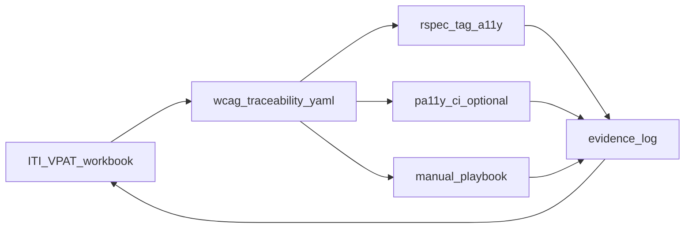

# Hyku — accessibility, VPAT, and WCAG 2.1 AA

Hyku supports a **VPAT-oriented** conformance workflow: the ITI workbook, a WCAG 2.1 A/AA traceability matrix ([`wcag-2.1-aa-traceability-matrix.yaml`](./wcag-2.1-aa-traceability-matrix.yaml)), automated **axe-core** runs on selected user journeys in RSpec, **Playwright + @axe-core/playwright** route audits against Docker-seeded demo content (WCAG **A/AA** blocking; **AAA** report-only), optional **Pa11y** scans for broader public-page coverage, an **evidence log** for repeatable ACR drafting, and the **manual release playbook** below.

**Contents:** [Workflow](#workflow) · [Quick commands](#quick-commands) · [Playwright route audit](#playwright-route-audit-docker) · [Coverage progress](#accessibility-test-coverage-progress) · [VPAT draft](#vpat-product-information-draft) · [Traceability](#traceability) · [Axe testing](#automated-axe-testing) · [Docker](#running-specs-in-docker) · [Manual playbook](#manual-release-playbook) · [Evidence package](#evidence-package-for-acr-drafting) · [Third-party](#third-party-components-and-vpat-scope) · [CI artifacts](#ci-artifacts-and-isolated-jobs) · [Pa11y](#pa11y--site-wide-scan-operators) · [5→7 regression](#hyku-5--71-regression-focus) · [Artifacts env](#artifacts-a11y_artifacts)

**Templates:** [ACR evidence](acr-evidence-template.md) · [Manual results CSV](manual-results-template.csv) · [VPAT workbook checklist](vpat-workbook-checklist.md) · [Pa11y sample config](pa11yci.sample.json) · [Pa11y GitHub Actions example](pa11y-github-actions.example.yml)

## Workflow



1. Use the [ITI VPAT](https://www.itic.org/policy/accessibility/vpat) workbook that matches your procurement requirement (for WCAG 2.1, use the current ITI workbook your organization has approved).
2. Map each success criterion to evidence and coverage in [`wcag-2.1-aa-traceability-matrix.yaml`](./wcag-2.1-aa-traceability-matrix.yaml).
3. Run **`bin/rspec-a11y`** on critical journeys; optionally archive **`tmp/a11y/`**.
4. Optionally run **Pa11y CI** against a stable public/staging URL list for broader anonymous-page scanning.
5. Run the **manual release playbook** for criteria that automation cannot fully verify.
6. Record findings in an **evidence log** before drafting VPAT row language.

## Quick commands

```bash
docker compose exec web bin/rspec-a11y
# optional VPAT artifacts:
docker compose exec -e A11Y_ARTIFACTS=1 web bin/rspec-a11y
# a11y journey + matrix progress (like SimpleCov for axe scope):
docker compose exec web bundle exec rake hyku:accessibility:coverage_report
# optional broader anonymous scan:
npx pa11y-ci
```

Specs: [`spec/features/accessibility/critical_paths_accessibility_spec.rb`](../../spec/features/accessibility/critical_paths_accessibility_spec.rb), [`spec/features/accessibility/extended_paths_accessibility_spec.rb`](../../spec/features/accessibility/extended_paths_accessibility_spec.rb). Helper: [`spec/support/accessibility_helpers.rb`](../../spec/support/accessibility_helpers.rb).

After changing **public-facing UI** (`app/assets/stylesheets/`, shared views, appearance templates), run the command above before merging.

### Playwright route audit (Docker)

Use this in **Docker Compose** (same stack as RSpec): seed a dedicated demo tenant and repository objects in **`RAILS_ENV=test`**, then run **Playwright** against hostnames that match **Traefik** routing (`HostRegexp(`.+-${APP_NAME}.localhost.direct`)`) and **`HYKU_DEFAULT_HOST`**. With default `APP_NAME=hyku`, the demo tenant is **`a11y-demo-hyku.localhost.direct`** (not `a11y-demo.localhost.direct`). The `web` service `extra_hosts` entries align with that; from your Mac, `*.localhost.direct` resolves via public DNS to `127.0.0.1`.

1. **Seed** (writes `e2e/a11y-routes/a11y-routes.manifest.json`; gitignored — see [`a11y-routes.manifest.json.example`](../../e2e/a11y-routes/a11y-routes.manifest.json.example)):

   ```bash
   docker compose exec -e RAILS_ENV=test web bundle exec rake db:migrate hyku:demo_content:seed
   ```

   In **development** inside Compose, `.env` sets `IN_DOCKER=true`, so you can seed without `RAILS_ENV=test` if you prefer the dev DB: `docker compose exec web bundle exec rake hyku:demo_content:seed` (still blocked in `production`).

   **Manifest URLs:** by default the seed writes a **curated** list only (public/catalog/collection/help paths and a few others using the real seeded collection and work ids). Optional **route discovery** (`HYKU_A11Y_MANIFEST_DISCOVERY_MAX`, e.g. `100`) introspects named GET routes and can add many extra paths, but it may generate **invalid** URLs (the same work id substituted into unrelated `:id` segments), which makes Playwright axe runs fail on error pages. Leave discovery unset or `0` for stable CI and local audits; raise the limit only when experimenting and you can vet the manifest.

   **Dashboard (authenticated):** the seed creates **`hyku-a11y-admin@example.com`** with tenant admin + Hyrax admin group membership (password `HYKU_DEMO_A11Y_ADMIN_PASSWORD`, else `HYKU_USER_DEFAULT_PASSWORD`, else `password`). The manifest includes **`authenticated_routes`** (dashboard, works, collections, appearance). Playwright **`global-setup.ts`** signs in on the tenant host and saves **`e2e/a11y-routes/.auth/a11y-admin.json`** (gitignored). **`./bin/playwright-a11y`** exports `HYKU_DEMO_A11Y_ADMIN_PASSWORD` defaulting to `password` so the login matches the seed without extra env in local/CI.

2. **Run audits** (starts a short-lived Rails test server; first run installs browsers + OS deps via Playwright):

   ```bash
   docker compose exec -e RAILS_ENV=test -e HYKU_ADMIN_HOST=admin-hyku.localhost.direct \
     -e HYKU_ROOT_HOST=admin-hyku.localhost.direct web ./bin/playwright-a11y
   ```

   If the `web` service already listens on port **3000** (the usual dev Puma), set e.g. `-e PLAYWRIGHT_SERVER_PORT=9876` so the script’s test server can bind. On **linux/arm64** Docker, the script uses **Firefox** headless (Chromium’s GPU helper often fails there); on **amd64** it uses Chromium with `install --with-deps` when `/.dockerenv` is present.

**Conformance:** each route must return a **successful HTTP response** (`response.ok()`, i.e. 2xx/3xx after redirects); **4xx/5xx** fails the test immediately with a clear message so axe is not run against error pages. The **blocking** run uses axe tags **`wcag2a`**, **`wcag2aa`**, **`wcag21aa`** and scans the primary landmark (`#content-wrapper` when present, else `#content` / `main`, else `body`) — aligned with [`spec/support/accessibility_helpers.rb`](../../spec/support/accessibility_helpers.rb) where the layout provides `#content-wrapper`. A second pass records **AAA**-tag violations under `tmp/playwright-a11y/*.violations.aaa.json` **without failing** the job.

**Optional crawl:** `PLAYWRIGHT_CRAWL=1` (and optional `PLAYWRIGHT_CRAWL_MAX`) enables a capped BFS from the seeded collection page — see [`e2e/a11y-routes/tests/crawl.supplement.spec.ts`](../../e2e/a11y-routes/tests/crawl.supplement.spec.ts).

**CI:** [`build-test-lint`](../../.github/workflows/build-test-lint.yaml) runs `hyku:demo_content:seed` after test DB migrate and runs `./bin/playwright-a11y` on **node0** only (after `rspec_booster`).

### Accessibility test coverage (progress)

This is **not** “percent WCAG conformant.” It is a **SimpleCov-style progress report** for what you automate: how many `:a11y` journeys exist and how well the [traceability matrix](./wcag-2.1-aa-traceability-matrix.yaml) links `automated_axe` / `semi_automated` rows to spec files.

```bash
bundle exec rake hyku:accessibility:coverage_report
# Docker:
docker compose exec web bundle exec rake hyku:accessibility:coverage_report
# Quieter boot (fewer SQL / deprecation lines before the banner):
# RAILS_LOG_LEVEL=fatal docker compose exec -e RAILS_LOG_LEVEL=fatal web bundle exec rake hyku:accessibility:coverage_report
```

Loading any Rails rake task boots the app, so you may see SQL, GoodJob, and deprecation output **above** the `====` banner; that is normal. The summary block at the end is what matters.

The task prints: accessibility spec files, **`rspec --dry-run --tag a11y`** example count, matrix totals by `coverage` type, **linkage %** (rows with non-empty `specs:`), unlinked semi-automated rows, and a count of URLs in [`pa11yci.sample.json`](./pa11yci.sample.json).

**Suggested milestones**

- **M1:** All `automated_axe` matrix rows list at least one spec path (traceability for procurement).
- **M2:** Increase `:a11y` example count as you add journeys; update matrix `specs` when you expand axe coverage.
- **M3 (optional):** Grow the Pa11y URL list for anonymous breadth on staging.

**Ruby line coverage:** [SimpleCov](https://github.com/simplecov-ruby/simplecov) in [`spec/rails_helper.rb`](../../spec/rails_helper.rb) measures **code executed** by RSpec, not pages scanned by axe. Use both reports: SimpleCov for Ruby, this rake task for **a11y journey + matrix** progress.

### Verifying that CI runs `:a11y` examples

The [`build-test-lint`](../../.github/workflows/build-test-lint.yaml) workflow’s **`test`** job invokes the reusable **`test.yaml`** job with `rspec_booster --job …`, which runs the **entire** RSpec suite (not tag-filtered). Examples under `spec/features/accessibility/` tagged `:a11y` therefore run with every PR/push to `main`, alongside other feature specs.

**How to confirm in GitHub:** open a successful **`build-test-lint` → `test`** log and search for **`VPAT`** (example descriptions include that prefix). You can also compare the reported example count to a local `bundle exec rspec --dry-run` total if needed.

If your fork ever changes `rspec_cmd` to exclude tags, restore full-suite behavior or add a dedicated `rspec --tag a11y` job so accessibility regressions still block merges.

**Playwright:** the same workflow runs `bin/playwright-a11y` on the first parallel test node; check logs for Playwright output and inspect `tmp/playwright-a11y/` locally after a Docker run.

---

## VPAT product information (draft)

This is **not** a completed VPAT. Paste into the ITI workbook; legal/procurement should review final wording.

### Conformance target

| Item | Value |
|------|--------|
| **WCAG** | 2.1 Level **A** and **AA** |
| **Revised Section 508** | Chapter 3 / Chapter 4 rows as represented in the ITI workbook |
| **EN 301 549** | Only if procurement requires it |

### Product fields

| Field | Suggested content |
|-------|-------------------|
| **Product name** | Hyku (Hydra-in-a-Box) |
| **Product version** | Release tag, deployment manifest, or commit |
| **Vendor / developer** | Your organization |
| **Contact for accessibility** | Name, email, phone |
| **Report date** | Evaluation date |
| **Evaluation methods used** | axe-core RSpec, optional Pa11y CI, manual keyboard/zoom/AT checks |
| **Scope notes** | Rails + Hyrax + Blacklight. Some surfaces are third-party or upstream (Universal Viewer, pdf.js). Describe what **your deployment** exposes. |

### Evaluation methods (summary)

1. **Automated critical-path testing**: `axe-core-rspec` on selected journeys in Docker/CI.
2. **Automated broader anonymous-page scanning**: Pa11y CI on stable public URLs.
3. **Manual validation**: keyboard, zoom/reflow, text spacing, screen reader smoke, modals/live regions, third-party viewer checks.
4. **Environment capture**: document browser(s), OS, staging/build URL, AT used, and test date.

### ACR status guidance

Use these status labels consistently when drafting workbook rows:

| Status | When to use |
|--------|-------------|
| **Supports** | No known failures for the evaluated deployment and evidence covers the criterion appropriately. |
| **Partially Supports** | Some failures or exceptions exist, but major functionality remains accessible or remediation is in progress. |
| **Does Not Support** | A blocking or systemic failure prevents conformance for the evaluated criterion. |
| **Not Applicable** | The product/deployment does not expose that functionality. |

Do not mark a criterion **Supports** purely because there are no automated failures. Manual-only and semi-automated criteria still need human review notes.

---

## Traceability

Full WCAG 2.1 A/AA list, coverage type (`automated_axe` | `semi_automated` | `manual`), evidence notes, and spec references live in [`wcag-2.1-aa-traceability-matrix.yaml`](./wcag-2.1-aa-traceability-matrix.yaml).

Recommended interpretation:

- **automated_axe**: can produce repeatable evidence via `axe-core-rspec`; still allow scoped manual confirmation where noted.
- **semi_automated**: automation can find some defect classes, but conformance still needs manual review.
- **manual**: must be verified through human testing and notes.

---

## Automated axe testing

- **Tags**: `wcag2a`, `wcag2aa`, `wcag21aa`
- **Primary scan region**: `#content-wrapper` on each `:a11y` path
- **Not fully covered in one scan**: Universal Viewer iframe, full pdf.js surface, some global chrome, live region behavior, focus management
- **Exclusions**: add `.excluding(...)` only for documented third-party or known-noise cases, and log selector + rationale in evidence notes

```ruby
expect(page).to be_axe_clean
  .according_to(*HykuAccessibility::AxeConfiguration::TAGS)
  .within('#content-wrapper')
  .excluding('#uv-embed') # example only — not enabled by default
```

**Modals / live regions:** Deposit wizard dialogs, share/embargo modals, Bulkrax or plugin overlays must be validated manually, not only with axe.

**Tenant themes:** Appearance-derived colors can reintroduce `color-contrast` issues. Treat tenant branding as part of the evaluated surface if it ships to users.

**Advanced search (`/advanced`):** Blacklight Advanced Search currently ships a `<select id="op">` without an accessible name, which fails axe `select-name`. It is intentionally omitted from the `:a11y` suite until remediated (local override or upstream fix); validate manually or with Pa11y and track as a known exception if that page is in scope.

---

## Running specs in Docker

Axe specs are **`js: true` feature specs** and need **`web`**, **`chrome`**, and the usual dependencies (Postgres, Solr, Fedora if enabled, Redis, ZooKeeper).

1. `docker compose build web`
2. `docker compose up web`
3. `docker compose exec web bundle install`
4. `docker compose exec web bin/rspec-a11y`

When `A11Y_ARTIFACTS=1` is set, archive `tmp/a11y/` for evidence.

---

## Manual release playbook

Run after automated checks pass. Use at least one Chromium browser and Firefox or Safari; NVDA and/or VoiceOver for spot checks. Prefer staging and a non-production account.

### Checklist ↔ WCAG (quick map)

| Section | Primary WCAG | Matrix coverage |
|---------|--------------|-----------------|
| Keyboard | 2.1.1, 2.1.2, 2.4.3, 2.4.7 | Often manual / semi |
| Zoom and reflow | 1.4.4, 1.4.10 | Manual |
| Text spacing | 1.4.12 | Manual |
| Forms and errors | 3.3.1, 3.3.2, 3.3.3, 3.3.4 | Semi / manual |
| Media / time | 1.2.x, 2.2.x | Manual |
| Third-party viewers | 1.1.1, 2.1.x, 4.1.2 | Manual + VPAT exceptions |
| Screen reader | 4.1.2, 4.1.3 | Manual |
| Hover / focus content | 1.4.13 | Manual |

### 1. Keyboard

On splash/home, catalog, public work show, sign-in, dashboard, one deposit step, and one admin/settings surface if shipped to end users: tab in logical order; no traps; visible focus; Escape closes dialogs where expected; skip link (if present) moves focus to main content.

### 2. Zoom and reflow

At 200% zoom and at ~320 CSS px width, primary tasks remain usable without hidden or overlapping controls.

### 3. Text spacing

Larger text and reader-style spacing do not clip headings, buttons, field labels, help text, or error messages on key templates.

### 4. Forms and errors

Trigger at least one invalid submit and one recoverable validation path. Confirm error message visibility, association, and correction guidance.

### 5. Media / auto-updating content

If audio/video, timed sessions, carousels, or updating regions exist, verify captions, controls, pause/stop, timeout messaging, and recovery expectations.

### 6. Third-party viewers

Universal Viewer / IIIF / PDF: keyboard reachability, focus handling, visible labels, and whether exceptions need to be noted in the VPAT.

### 7. Screen reader smoke

One work show page and one form: landmarks, reading order, field names, error announcements, and dynamic updates are discoverable.

### 8. Hover / focus content

Tooltips, menus, and hover-only affordances are dismissible, hoverable, and persistent where required.

### 9. Document results

For each manual section, record date, tester, environment, URL, pass/fail, and notes in the evidence template.

---

## Evidence package for ACR drafting

The most common gap in VPAT work is having tests but not having **evidence that can be pasted into the ACR**. For each release or evaluated deployment, keep:

- automated test command used
- commit/tag/build identifier
- browser + OS + AT
- URLs / journeys tested
- failures or exclusions
- screenshots or artifact paths
- manual findings summary
- third-party exceptions and ownership

Use the companion file [`acr-evidence-template.md`](./acr-evidence-template.md) to capture this consistently.

Suggested repo layout:

```text
docs/accessibility/
  README.md
  wcag-2.1-aa-traceability-matrix.yaml
  acr-evidence-template.md
  manual-results-template.csv
  pa11yci.sample.json
```

---

## Third-party components and VPAT scope

| Component | Role | VPAT guidance |
|-----------|------|----------------|
| **Universal Viewer** | IIIF viewer (`public/uv`) | Often **Partially Supports** / **Supports with exceptions** depending on deployment and fixes. Note version/config. |
| **pdf.js** | In-browser PDF (`public/pdf.js`) | Third-party; document toolbar/annotation UI exceptions if exposed. |
| **Blacklight** | Search, facets, pagination | Usually in scope for the app; upstream issues may still be noted as exceptions. |
| **Hyrax** | Dashboards, forms, breadcrumbs, modals | In scope when shipped in the deployment. |
| **Bootstrap 4** | Layout/components | Usually fix locally in CSS/theme unless failure is strictly upstream and unmodified. |

Use **Not Applicable** only when the feature is not deployed or not user-facing.

---

## CI artifacts and isolated jobs

`:a11y` examples need the **same services** as other JS feature specs.

**Optional artifact upload:**

```yaml
env:
  A11Y_ARTIFACTS: "1"

- uses: actions/upload-artifact@v4
  with:
    name: a11y-artifacts
    path: tmp/a11y/
```

For a separate CI job, mirror the same browser/service stack as your main JS feature spec job.

---

## Pa11y / site-wide scan (operators)

Use **Pa11y CI** when you want many public URLs scanned against WCAG2AA outside the RSpec journeys. This is best for anonymous pages and broad regression spotting.

Install:

```bash
npm install --save-dev pa11y-ci
```

Sample config lives in [`pa11yci.sample.json`](./pa11yci.sample.json). For a **scheduled GitHub Actions** sketch (staging URL secret, artifact upload), see [`pa11y-github-actions.example.yml`](./pa11y-github-actions.example.yml) — copy and uncomment into `.github/workflows/` when ready.

Pa11y does **not** replace logged-in axe feature specs or manual testing.

---

## Hyku 5 → 7.1 regression focus

Prioritized retest map:

| WCAG | Topic | Automated / semi | Manual / product |
|------|-------|------------------|------------------|
| 1.1.1 | Non-text content | axe in accessibility specs | Deposit, uploaded content |
| 1.3.1 | Info and relationships | axe + structural checks | Custom themes, nested viewers |
| 1.4.3 | Contrast | axe + theme remediation | Tenant themes |
| 2.1.1 | Keyboard | manual playbook | Facets, UV, pdf.js, wizards |
| 2.1.2 | No keyboard trap | manual playbook | Modals, editors |
| 4.1.2 | Name, role, value | axe ARIA/widget rules | Custom JS, embeds |
| 4.1.3 | Status messages | limited automation | `aria-live`, Turbo updates |

---

## Artifacts (`A11Y_ARTIFACTS`)

Set `A11Y_ARTIFACTS=1` when running RSpec. Each `:a11y` example can write under `tmp/a11y/` (URL, HTML snapshot, axe JSON). Upload that directory for evidence collection.
