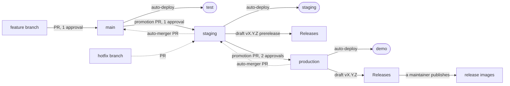

# Branching and Releases

Hyku follows a [GitLab Flow](https://docs.gitlab.com/ee/topics/gitlab_flow.html) branching model with three long-lived branches that map to environments.

Solid arrows are the normal flow. Dashed arrows are a hotfix and the merge-down pull requests the auto-merger opens after it.

## Branches

| Branch | Environment | Auto-deploy |
|---|---|---|
| `main` | test | yes |
| `staging` | staging | yes |
| `production` | demo | yes |

Code flows in one direction: `main` -> `staging` -> `production`. Each promotion is a merge-forward PR. A push to any of the three branches runs Build Test Lint, and when it passes, the Deploy workflow rolls that branch out to its environment.

## Rules

- **Merge only.** Squash and rebase are disabled on all three branches. This keeps commit SHAs identical across branches so you can always tell whether a commit has reached a given environment.
- **Pull requests only.** No direct pushes to `main`, `staging` or `production`.
- **Approvals.** One approval on PRs into `main` and `staging`, two on PRs into `production`.
- **Required labels.** Every PR needs one of `major-ver`, `minor-ver`, `patch-ver`, `dependencies` or `ignore-for-release`, so release notes categorize correctly. Promotion PRs usually take `ignore-for-release`.

## Promoting code

1. Open a PR from `main` into `staging` (or `staging` into `production`).
2. Get approval and merge. Do not squash.
3. The merge triggers CI, and on success the deploy workflow pushes to the matching environment automatically.

## Hotfixes

A fix that can't wait for the next promotion goes into the environment branch directly, so it ships without whatever `main` holds that isn't ready.

1. Branch from the environment branch: `git switch -c hotfix/<name> origin/staging`.
2. Open a PR into `staging`, label it `patch-ver`, and merge. Promote to `production` as usual.
3. The auto-merger opens merge-down PRs (`staging` -> `main`, and `production` -> `staging`). Review and merge them, so `main` never lacks a commit an environment has. Otherwise the next promotion reverts the fix.

## Releases

Release notes are drafted with [release-drafter](https://github.com/release-drafter/release-drafter). Nothing publishes on its own.

1. **Staging push: draft prerelease.** When code is merged into `staging`, release-drafter collects the PRs since the last release, groups them by label, and drafts a prerelease.
2. **Production push: draft release.** When code is merged into `production`, it drafts the stable release.
3. **Version bump.** Each draft run commits the resolved version to `config/initializers/version.rb` on that branch.
4. **Publish by hand.** A maintainer reviews the draft and publishes it. Publishing triggers the Release Images workflow, which tags the images `latest` (or `prerelease`).

### Labels and categories

| Label | Release category | Version bump |
|---|---|---|
| `major-ver` | Breaking Changes | major |
| `minor-ver` | New Features | minor |
| `patch-ver` | Bug Fixes | patch |
| `dependencies` | Dependencies | patch |
| any other label | Other Changes | patch |
| `ignore-for-release` | (excluded) | - |

If no version label is present, the default bump is `patch`.

## Knapsack repositories

Knapsack repositories (e.g. `notch8/hykuup_knapsack`, `notch8/utk_knapsack`) follow the same model with their own branch-to-environment mappings. Each knapsack maintains its own release version line independent of Hyku's version, documented in its README under **Deploying**.
