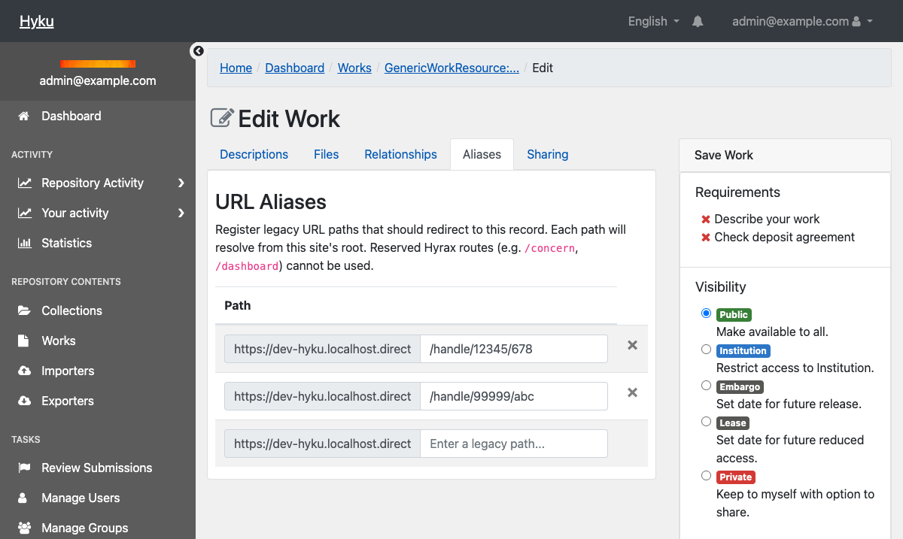
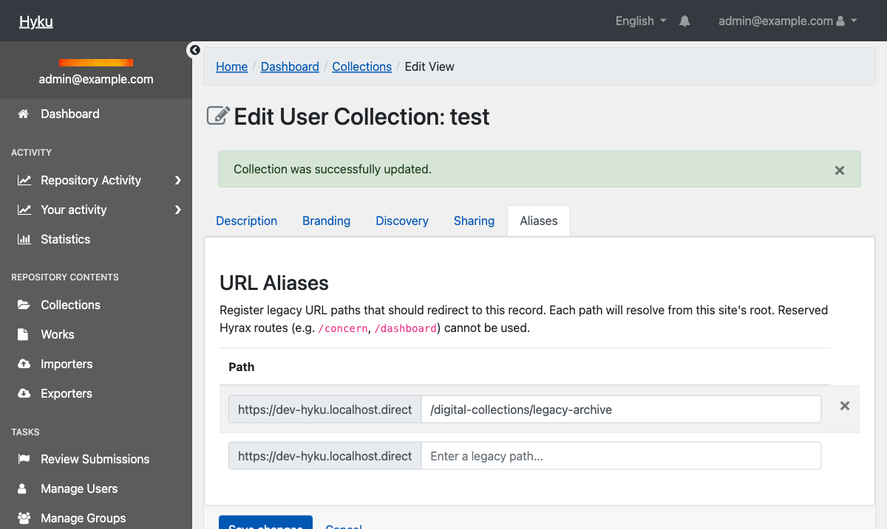

# Pass 1: HYRAX_FLEXIBLE=false (default schema mode)

## Redirects Feature — Test Results

**Date:** 2026-05-06 (initial), 2026-05-08 (retest after fix)
**Tester:** Claude Code (automated via Playwright MCP + curl + rails runner)
**Branch:** `spike/redirects-feature`
**Mode:** Pass 1 — `HYRAX_FLEXIBLE=false`
**Tenant:** dev-hyku.localhost.direct
**Config:** `HYRAX_REDIRECTS_ENABLED=true`, FlipFlop `redirects` = ON

### Summary

| | Count |
|--|-------|
| Passed | 29 |
| Failed | 0 |
| Skipped (upstream/manual) | 12 |
| **Total executed** | **29** |
| Bugs found | 1 (fixed by LaRita — `RedirectsFieldBehavior` now adds `property :redirects` to the form) |

---

## Section 0: Environment check

**Method:** `docker compose exec web bash -c "echo $VAR"` and `rails runner` within tenant context

| Check | Command/Action | Output | Result |
|-------|----------------|--------|--------|
| HYRAX_FLEXIBLE | `echo $HYRAX_FLEXIBLE` | `false` | PASS |
| HYRAX_REDIRECTS_ENABLED | `echo $HYRAX_REDIRECTS_ENABLED` | `true` | PASS |
| `Hyrax.config.flexible?` | `rails runner` | `false` | PASS |
| `Hyrax.config.redirects_enabled?` | `rails runner` | `true` | PASS |
| `Hyrax.config.redirects_active?` (in tenant) | `rails runner` with `AccountElevator.switch!` | `true` | PASS |
| `Flipflop.redirects?` (in tenant) | `rails runner` | `true` | PASS |
| `work_default_metadata` | `rails runner` | `true` | PASS |
| `Hyrax::Work.attribute_names.include?(:redirects)` | `rails runner` | `true` | PASS |
| `Hyrax::PcdmCollection.attribute_names.include?(:redirects)` | `rails runner` | `true` | PASS |

Schema loaded via `Hyrax::Schema(:redirects)` because `work_default_metadata` is `true` when `flexible?` is `false`.

---

## BUG FOUND AND FIXED: Form crash in default schema mode

### Initial failure (2026-05-06)

The work edit form crashed with `NoMethodError: undefined method 'redirects' for an instance of GenericWorkResourceForm`. `RedirectsFieldBehavior.included` only added `redirects_attributes` (virtual) to the form, not `redirects` itself. In flexible mode the m3 loader adds both; in default mode nothing added `property :redirects` to the form.

Screenshot: NoMethodError before fix

Screenshot: Error detail — line 21 of _form_redirects.html.erb

### Fix applied (2026-05-08)

LaRita fixed `RedirectsFieldBehavior.included` upstream in Hyrax to also add `property :redirects` to the form when `redirects_enabled?` is true.

### Retest after fix (2026-05-08)

All previously-blocked form tests now pass.

Screenshot: Aliases tab renders correctly after fix

---

## Section 2: Form — adding redirects to a work (retested 2026-05-08)

**Method:** Playwright MCP (browser automation)
**Work:** "cat" (ID: `8fc66f72-cf17-41a9-9fdb-8c42b468239c`)

| Check | Action | Output | Result |
|-------|--------|--------|--------|
| Aliases tab visible | Navigate to work edit, check tab bar | Tab "Aliases" present | PASS |
| Add path `/pass1/test/path`, save | Click Aliases tab, type path, click Save | Redirected to show page with success | PASS |
| Entry persists on reload | Navigate back to edit, click Aliases tab | All 3 entries visible | PASS |
| Reserved prefix `/single_signon` rejected | Type path on different work, save | `"/single_signon" can't be used. The path is reserved...` | PASS |

---

## Section 3: Form — adding redirects to a collection (retested 2026-05-08)

**Method:** Playwright MCP (browser automation)
**Collection:** "test" (ID: `2d877855-2820-49a3-a15e-b978eda60e62`)

| Check | Action | Output | Result |
|-------|--------|--------|--------|
| Aliases tab visible on collection edit | Navigate to collection edit, check tab bar | Tab "Aliases" present alongside Description, Branding, Discovery, Sharing | PASS |
| Add path `/digital-collections/legacy-archive`, save | Click Aliases tab, type path, click Save | "Collection was successfully updated." | PASS |
| Entry persists on reload | Click Aliases tab again | `/digital-collections/legacy-archive` visible with Remove button | PASS |
| Resolver: collection redirect | `curl -sk -I /digital-collections/legacy-archive` | **301** to `/collections/2d877855-...?locale=en` | PASS |

Screenshot: Collection Aliases tab with persisted entry

---

## Section 4: Resolver — 301 redirect at request time

**Method:** `curl -sk -I -u samvera:hyku https://dev-hyku.localhost.direct/<path>`

| Check | URL | HTTP Status | Result |
|-------|-----|-------------|--------|
| Work redirect | `/handle/12345/678` | **301** | PASS |
| New path | `/pass1/test/path` | **301** | PASS |
| Trailing slash | `/handle/12345/678/` | **301** | PASS |
| Unregistered path | `/does-not-exist` | **404** | PASS |
| Real route: `/dashboard` | `/dashboard` | **302** (login redirect) | PASS |

---

## Section 6: Route interactions

**Method:** `curl -sk -o /dev/null -w "%{http_code}" -u samvera:hyku`

| Route | HTTP Status | Result |
|-------|-------------|--------|
| `/status` | 302 | PASS |
| `/importers` | 302 | PASS |
| `/bookmarks` | 200 | PASS |
| `/browse` | 200 | PASS |
| `/sword` | 401 | PASS |

---

## Comparison: Pass 1 vs Pass 2

| Area | Pass 2 (flexible=true) | Pass 1 (flexible=false) |
|------|------------------------|-------------------------|
| Environment checks | PASS | PASS |
| Schema on model | PASS | PASS |
| Schema on form | PASS | PASS (after fix) |
| Form renders | PASS | PASS (after fix) |
| Add/persist redirects | PASS | PASS (after fix) |
| Validation rules | PASS | PASS (after fix) |
| Resolver (301/404) | PASS | PASS |
| Route interactions | PASS | PASS |

---

## Still requires manual testing

### Requires app restart with different env vars:
- [ ] Two-layer gating: set `HYRAX_REDIRECTS_ENABLED=false`, reboot — confirm no Redirects tab, FlipFlop UI does not show `redirects`, previously-registered path returns 404
- [ ] Two-layer gating: set `HYRAX_REDIRECTS_ENABLED=true`, reboot, toggle FlipFlop OFF — confirm tab present but path returns 404

### Requires multi-tenant setup:
- [ ] Per-tenant FlipFlop scoping — enable on tenant A, leave off on tenant B
- [ ] Cache key isolation — same path on two tenants resolves to correct respective record within 60s
- [ ] Admin host vs tenant host — `/account` accepted as redirect on tenant, resolves via 301

### Timing-sensitive:
- [ ] Race condition — two browser tabs, same path on different works, save both simultaneously

### Form interactions not yet tested in this pass:
- [ ] Save a full URL — confirm normalized to path-only
- [ ] Mark entry as canonical, save, reload — confirm flag persists
- [ ] Cross-record duplicate — expect "already in use" error
- [ ] Intra-record duplicate — expect "listed more than once" error
- [ ] Two canonicals — expect "at most one" error
- [ ] Bad format (whitespace, `?`, `#`) — expect "not a valid redirect path"
- [ ] Remove an entry via form, save — confirm ledger row deleted
- [ ] Edit collection, find Redirects tab, add path, save, reload
- [ ] Collection thumbnail upload still works after decorator refactor
- [ ] Collection banner/logo upload still works after decorator refactor
- [ ] Delete a work entirely — confirm all rows removed from `hyrax_redirect_paths`
