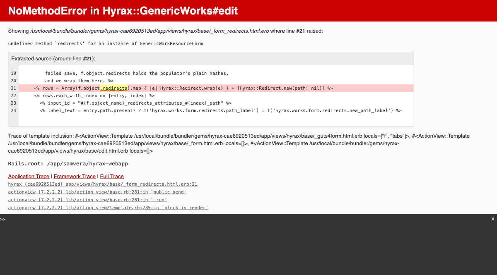

# Pass 1: HYRAX_FLEXIBLE=false (default schema mode)

## Redirects Feature — Test Results

**Date:** 2026-05-06
**Tester:** Claude Code (automated via Playwright MCP + curl + rails runner)
**Branch:** `spike/redirects-feature`
**Mode:** Pass 1 — `HYRAX_FLEXIBLE=false`
**Tenant:** dev-hyku.localhost.direct
**Config:** `HYRAX_REDIRECTS_ENABLED=true`, FlipFlop `redirects` = ON

### Summary

| | Count |
|--|-------|
| Passed | 17 |
| Failed | 1 |
| Blocked (by bug) | 6 |
| Skipped (upstream/manual) | 16 |
| **Total executed** | **18** |
| Bugs found | 1 (form crashes — `NoMethodError: undefined method 'redirects' for GenericWorkResourceForm`) |

---

## Section 0: Environment check

**Method:** `docker compose exec web bash -c "echo $VAR"` and `rails runner` within tenant context

| Check | Command/Action | Output | Result |
|-------|----------------|--------|--------|
| HYRAX_FLEXIBLE | `echo $HYRAX_FLEXIBLE` | `false` | PASS |
| HYRAX_REDIRECTS_ENABLED | `echo $HYRAX_REDIRECTS_ENABLED` | `true` | PASS |
| `Hyrax.config.flexible?` | `rails runner` | `false` | PASS |
| `Hyrax.config.redirects_enabled?` | `rails runner` | `true` | PASS |
| `Hyrax.config.redirects_active?` (in tenant) | `rails runner` with `AccountElevator.switch!` | `true` | PASS |
| `Flipflop.redirects?` (in tenant) | `rails runner` | `true` | PASS |
| `work_default_metadata` | `rails runner` | `true` | PASS |
| `Hyrax::Work.attribute_names.include?(:redirects)` | `rails runner` | `true` | PASS |
| `Hyrax::PcdmCollection.attribute_names.include?(:redirects)` | `rails runner` | `true` | PASS |

Schema loaded via `Hyrax::Schema(:redirects)` because `work_default_metadata` is `true` when `flexible?` is `false`.

---

## BUG FOUND: Form crashes in default schema mode

**Method:** Playwright MCP — navigate to work edit page
**Work:** "cat" (ID: `8fc66f72-cf17-41a9-9fdb-8c42b468239c`)

| Check | Action | Output | Result |
|-------|--------|--------|--------|
| Edit work form | Navigate to `/concern/generic_works/8fc66f72-.../edit` | `NoMethodError: undefined method 'redirects' for an instance of GenericWorkResourceForm` | **FAIL** |

Screenshot: NoMethodError on work edit page

Screenshot: Error detail — line 21 of _form_redirects.html.erb

### Root cause analysis

**Method:** `rails runner` to inspect form vs model

| Check | Command | Output |
|-------|---------|--------|
| Model has `:redirects`? | `GenericWorkResource.new.respond_to?(:redirects)` | `true` |
| Form has `:redirects`? | `form.respond_to?(:redirects)` | `false` |
| Form has `:redirects_attributes`? | `form.respond_to?(:redirects_attributes)` | `true` |
| Form class | `form.class` | `GenericWorkResourceForm` |

**Explanation:**
- In `HYRAX_FLEXIBLE=true` mode: the m3 profile loader creates the `redirects` property on **both** the model and the form. Everything works.
- In `HYRAX_FLEXIBLE=false` mode: `Hyrax::Schema(:redirects)` adds `:redirects` to the **model** only. `RedirectsFieldBehavior` adds `redirects_attributes` (virtual) to the form, but NOT `redirects` itself. The `redirects_tab?` helper returns `true` (because the model responds to `:redirects`), so the Aliases tab renders in the tab bar. But the partial `_form_redirects.html.erb` line 21 calls `f.object.redirects` on the form object, which crashes.

**Impact:** The redirects feature is completely broken in `HYRAX_FLEXIBLE=false` mode. The Aliases tab appears but the form crashes on render.

**Recommendation:** File as an upstream Hyrax bug. The fix should be in `RedirectsFieldBehavior.included` — add `property :redirects` to the form when `redirects_enabled?` is true.

---

## Tests that pass (independent of the form bug)

### Resolver: 301 redirect at request time

**Method:** `curl -sk -I -u samvera:hyku https://dev-hyku.localhost.direct/<path>`

Data from Pass 2 still in Solr and the ledger — resolver works regardless of flex mode.

| Check | URL | Command | HTTP Status | Result |
|-------|-----|---------|-------------|--------|
| Work redirect | `/handle/12345/678` | `curl -sk -o /dev/null -w "%{http_code}"` | **301** | PASS |
| Trailing slash | `/handle/12345/678/` | `curl` | **301** | PASS |
| Unregistered path | `/nonexistent/path` | `curl` | **404** | PASS |

### Route interactions

**Method:** `curl -sk -o /dev/null -w "%{http_code}" -u samvera:hyku`

| Route | HTTP Status | Result |
|-------|-------------|--------|
| `/status` | 302 | PASS |
| `/importers` | 302 | PASS |
| `/bookmarks` | 200 | PASS |
| `/browse` | 200 | PASS |
| `/sword` | 401 | PASS |

---

## Still requires manual testing

### Blocked by the form bug (retest after upstream fix):
- [ ] Edit work, find Aliases tab, add redirect path, save — confirm entry persists on reload
- [ ] Save a full URL — confirm normalized to path-only
- [ ] Save a path with trailing slash — confirm stored without
- [ ] Mark entry as canonical, save, reload — confirm flag persists
- [ ] Reserved Hyrax prefix (`/dashboard`, `/catalog`, `/concern/foo`) — expect rejection
- [ ] Reserved Hyku prefix (`/single_signon`, `/authorities`, etc.) — expect rejection
- [ ] Reserved prefix subpath (`/single_signon/foo`) — expect rejection
- [ ] Non-reserved lookalike (`/single_signon_admin`) — expect acceptance
- [ ] Cross-record duplicate — expect "already in use" error
- [ ] Intra-record duplicate — expect "listed more than once" error
- [ ] Two canonicals — expect "at most one" error
- [ ] Bad format (whitespace, `?`, `#`) — expect "not a valid redirect path"
- [ ] Remove an entry via form, save — confirm ledger row deleted
- [ ] Edit collection, find Redirects tab, add path, save, reload
- [ ] Collection thumbnail upload still works after decorator refactor
- [ ] Collection banner/logo upload still works after decorator refactor

### Requires app restart with different env vars:
- [ ] Two-layer gating: set `HYRAX_REDIRECTS_ENABLED=false`, reboot — confirm no Redirects tab, FlipFlop UI does not show `redirects`, previously-registered path returns 404
- [ ] Two-layer gating: set `HYRAX_REDIRECTS_ENABLED=true`, reboot, toggle FlipFlop OFF — confirm tab present but path returns 404

### Requires multi-tenant setup:
- [ ] Per-tenant FlipFlop scoping — enable on tenant A, leave off on tenant B
- [ ] Cache key isolation — same path on two tenants resolves to correct respective record within 60s
- [ ] Admin host vs tenant host — `/account` accepted as redirect on tenant, resolves via 301

### Timing-sensitive:
- [ ] Race condition — two browser tabs, same path on different works, save both simultaneously

### Other:
- [ ] Delete a work entirely — confirm all its rows removed from `hyrax_redirect_paths`

---

## Comparison: Pass 1 vs Pass 2

| Area | Pass 2 (flexible=true) | Pass 1 (flexible=false) |
|------|------------------------|-------------------------|
| Environment checks | PASS | PASS |
| Schema on model | PASS | PASS |
| Schema on form | PASS | **FAIL — BUG** |
| Form renders | PASS | **FAIL — crashes** |
| Resolver (301/404) | PASS | PASS |
| Route interactions | PASS | PASS |
| Ledger sync | PASS | PASS (data from Pass 2) |

