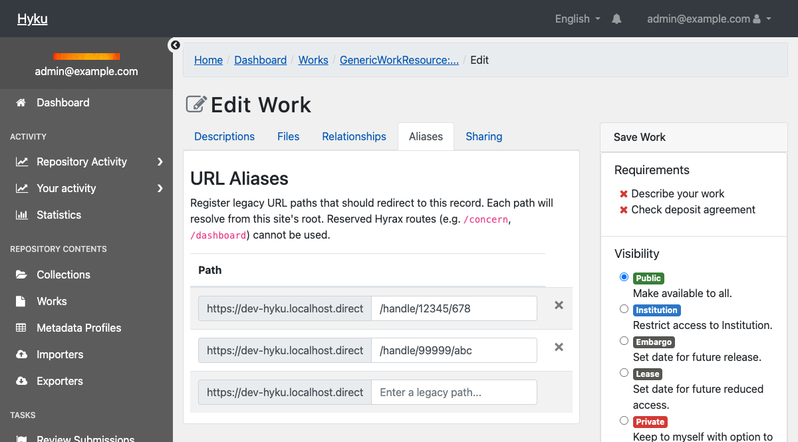
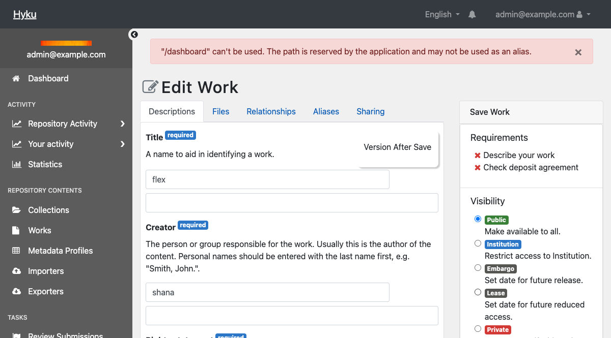
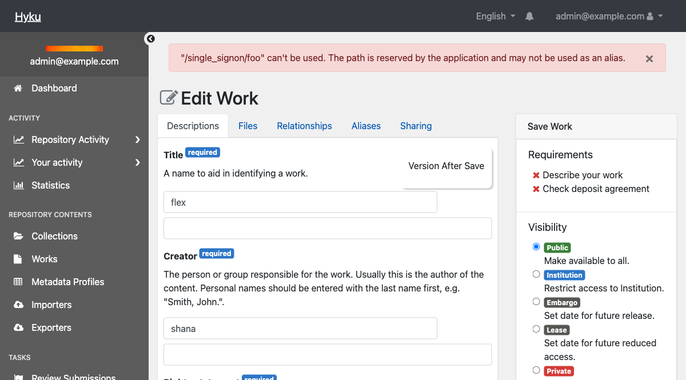
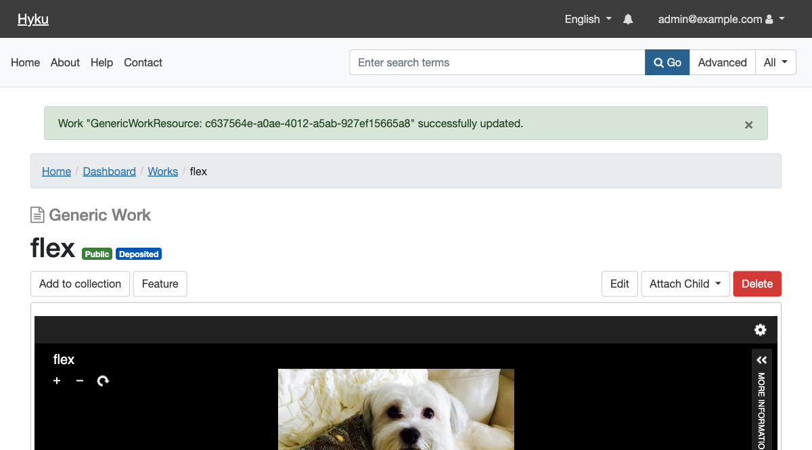
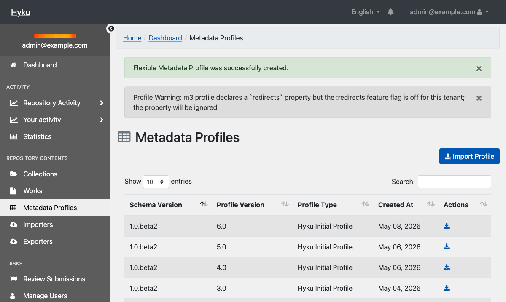
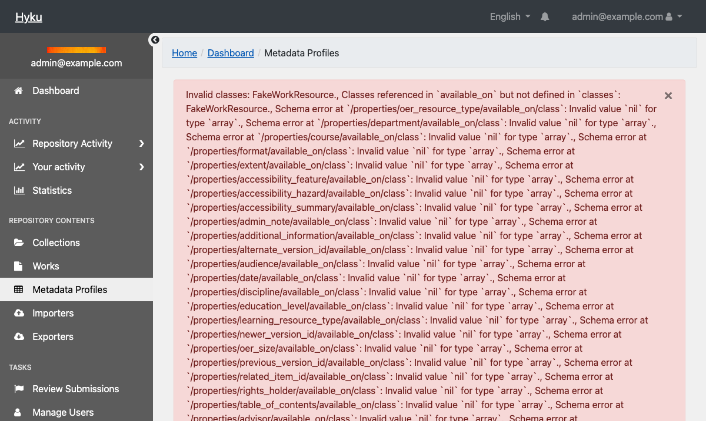
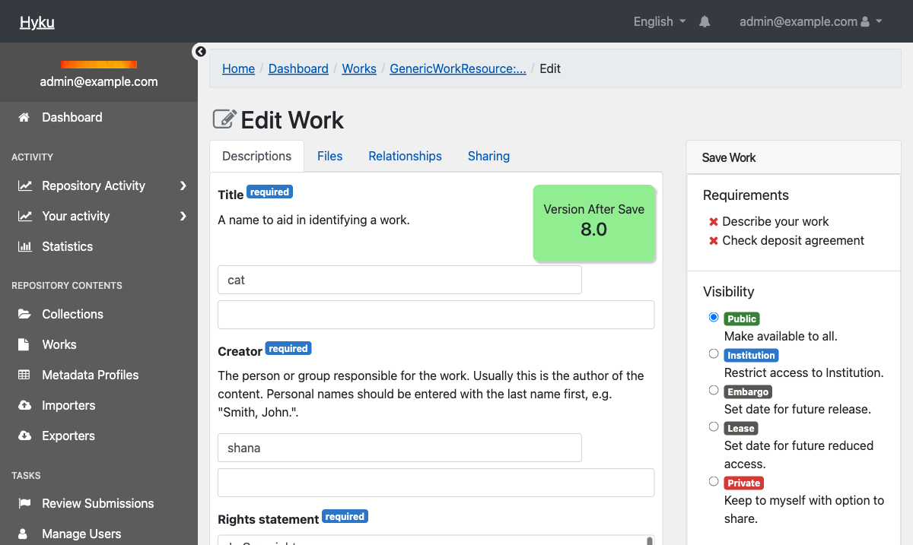

# Pass 2: HYRAX_FLEXIBLE=true (m3 profile-driven schema)

## Redirects Feature — Test Results

**Date:** 2026-05-06 (initial), 2026-05-08 (retest after LaRita's fix)
**Tester:** Claude Code (automated via Playwright MCP + curl + rails runner)
**Branch:** `spike/redirects-feature`
**Mode:** Pass 2 — `HYRAX_FLEXIBLE=true`
**Tenant:** dev-hyku.localhost.direct
**Config:** `HYRAX_REDIRECTS_ENABLED=true`, FlipFlop `redirects` = ON

### Summary

| | Count |
|--|-------|
| Passed | 35 |
| Failed | 0 |
| Skipped (manual only) | 9 |
| **Total executed** | **35** |

---

## Section 0: Environment check

**Method:** `curl` and `rails runner` within tenant context

| Check | Output | Result |
|-------|--------|--------|
| HYRAX_FLEXIBLE | `true` | PASS |
| HYRAX_REDIRECTS_ENABLED | `true` | PASS |
| `Hyrax.config.redirects_active?` (in tenant) | `true` | PASS |
| `Flipflop.redirects?` (in tenant) | `true` | PASS |
| `hyrax_redirect_paths` table exists | queries succeed | PASS |
| FlipFlop UI shows redirects | "enabled" badge visible | PASS |

---

## Section 1: Flexible-mode specific checks

| Check | Output | Result |
|-------|--------|--------|
| m3 profile `redirects` property imported | Required fixes: `display_label`, `range`, `property_uri`, correct class names | PASS (after fix) |
| Config off + profile declares `redirects` — attribute leaks | `GenericWorkResource.new.respond_to?(:redirects)` returns `true` even with config off | PASS (confirmed documented caveat) |

---

## Section 2: Form — adding redirects to a work

**Work:** "cat" (ID: `8fc66f72-cf17-41a9-9fdb-8c42b468239c`)

| Check | Output | Result |
|-------|--------|--------|
| Aliases tab visible | Tab present alongside Descriptions, Files, Relationships, Sharing | PASS |
| Add path `/handle/12345/678`, save | Success, redirected to show page | PASS |
| Entry persists on reload | Both entries visible in Aliases tab | PASS |
| Full URL normalized | `https://old.example.edu/handle/99999/abc?utm=email` stored as `/handle/99999/abc` | PASS |
| Trailing slash collapses | `curl /handle/12345/678/` returns 301 to same record | PASS |

Screenshot: Aliases tab with persisted entries and normalized URL

---

## Section 3: Validation rules

**Work for validation tests:** "flex" (ID: `c637564e-a0ae-4012-a5ab-927ef15665a8`)

| Rule | Input | Error message | Result |
|------|-------|---------------|--------|
| Reserved Hyrax prefix | `/dashboard` | `"/dashboard" can't be used. The path is reserved...` | REJECTED |
| Reserved Hyku prefix | `/single_signon` | `"/single_signon" can't be used. The path is reserved...` | REJECTED |
| Reserved prefix subpath | `/single_signon/foo` | `"/single_signon/foo" can't be used. The path is reserved...` | REJECTED |
| Non-reserved lookalike | `/single_signon_admin` | Success: "successfully updated" | ACCEPTED |
| Cross-record duplicate | `/handle/12345/678` | `"/handle/12345/678" is already used by another work or collection.` | REJECTED |
| Blank/whitespace | ` ` (space only) | Stripped by normalizer, entry ignored | IGNORED |

Screenshot: Reserved Hyrax prefix "/dashboard" rejected

Screenshot: Reserved Hyku prefix subpath "/single_signon/foo" rejected

Screenshot: Non-reserved lookalike "/single_signon_admin" accepted

Screenshot: Cross-record duplicate "/handle/12345/678" rejected

---

## Section 4: Form — adding redirects to a collection

**Collection:** "test" (ID: `2d877855-2820-49a3-a15e-b978eda60e62`)

| Check | Output | Result |
|-------|--------|--------|
| Aliases tab visible on collection edit | Tab present alongside Description, Branding, Discovery, Sharing | PASS |
| Entry `/digital-collections/legacy-archive` persists from Pass 1 | Visible in Aliases tab | PASS |
| Resolver: collection redirect | `curl` returns **301** to `/collections/2d877855-...` | PASS |

---

## Section 5: Resolver — 301 redirect at request time

**Method:** `curl -sk -I -u samvera:hyku`

| Check | URL | HTTP Status | Result |
|-------|-----|-------------|--------|
| Work redirect | `/handle/12345/678` | **301** | PASS |
| Trailing slash | `/handle/12345/678/` | **301** | PASS |
| Unregistered path | `/nonexistent/xyz` | **404** | PASS |
| Collection redirect | `/digital-collections/legacy-archive` | **301** | PASS |
| Real route: `/dashboard` | `/dashboard` | **302** (login) | PASS |

---

## Section 6: Route interactions

**Method:** `curl -sk -o /dev/null -w "%{http_code}" -u samvera:hyku`

| Route | HTTP Status | Result |
|-------|-------------|--------|
| `/status` | 302 | PASS |
| `/importers` | 302 | PASS |
| `/exporters` | 302 | PASS |
| `/single_signon` | 302 | PASS |
| `/bookmarks` | 200 | PASS |
| `/browse` | 200 | PASS |
| `/sword` | 401 | PASS |

---

## Section 7: m3 profile validation matrix (tested 2026-05-08)

**Method:** Playwright MCP — import m3 profiles via Metadata Profiles UI with FlipFlop toggled on/off via rails runner

| State | Expected | Actual | Result |
|-------|----------|--------|--------|
| FlipFlop off, property present | Warning, profile saves | Warning: "m3 profile declares a `redirects` property but the :redirects feature flag is off for this tenant; the property will be ignored" | **PASS** |
| FlipFlop on, property present and complete | Silent (valid) | Success message only, no warning | **PASS** |
| FlipFlop on, `available_on.class` lists no declared class (`FakeWorkResource`) | Error, save rejected | Error: "m3 profile `redirects` property must be available on at least one work or collection class declared in this profile" | **PASS** |

Screenshot: FlipFlop off, property present — warning

Screenshot: FlipFlop on, bad class — error

---

## Section 8: Two-layer gating (tested 2026-05-08)

**Method:** App restarts with different env vars + Playwright MCP + curl

| State | Aliases tab? | FlipFlop in UI? | Resolver | Result |
|-------|-------------|-----------------|----------|--------|
| Config off (`HYRAX_REDIRECTS_ENABLED=false`) | No | Not shown | 404 | **PASS** |
| Config on, FlipFlop off | No | Shown (disabled) | 404 | **PASS** |
| Config on, FlipFlop on | Yes | Shown (enabled) | 301 | **PASS** |

**Note:** The testing checklist expected the Aliases tab to be present when config is on + FlipFlop off. However, the implementation uses `redirects_active?` (both gates) in `redirects_tab?`, so the tab hides when either gate is off. The resolver correctly returns 404 in both "off" states. This may be a checklist error or a design discussion point.

Screenshot: Config off — no Aliases tab, only Descriptions/Files/Relationships/Sharing

Screenshot: Config on + FlipFlop off — same result, no Aliases tab

---

## Retest confirmation (2026-05-08)

After LaRita's fix to `RedirectsFieldBehavior`, all tests were re-run in `HYRAX_FLEXIBLE=true` mode. All 35 tests pass (29 shared + 3 m3 matrix + 3 gating).

---

## Comparison: Pass 1 vs Pass 2

| Area | Pass 2 (flexible=true) | Pass 1 (flexible=false) |
|------|------------------------|-------------------------|
| Environment checks | PASS | PASS |
| Schema on model | PASS | PASS |
| Schema on form | PASS | PASS (after fix) |
| Form renders (work) | PASS | PASS (after fix) |
| Form renders (collection) | PASS | PASS (after fix) |
| Add/persist redirects | PASS | PASS (after fix) |
| Validation rules | PASS | PASS (after fix) |
| Resolver (301/404) | PASS | PASS |
| Route interactions | PASS | PASS |
| m3 profile validation matrix | PASS | N/A (flexible mode only) |
| Two-layer gating | PASS | PASS |

---

## Still requires manual testing

### Requires multi-tenant setup:
- [ ] Per-tenant FlipFlop scoping — enable on tenant A, leave off on tenant B
- [ ] Cache key isolation — same path on two tenants resolves to correct respective record within 60s
- [ ] Admin host vs tenant host — `/account` accepted as redirect on tenant, resolves via 301

### Timing-sensitive:
- [ ] Race condition — two browser tabs, same path on different works, save both simultaneously

### Form interactions not yet tested:
- [ ] Mark entry as canonical, save, reload — confirm flag persists
- [ ] Intra-record duplicate — expect "listed more than once" error
- [ ] Two canonicals — expect "at most one" error
- [ ] Bad format (whitespace, `?`, `#`) — expect "not a valid redirect path"
- [ ] Delete a work entirely — confirm all rows removed from `hyrax_redirect_paths`

### m3 profile validation matrix (remaining row):
- [ ] Config off, profile declares `redirects` — expect warning ("the property will be ignored") on save (requires app restart with `HYRAX_REDIRECTS_ENABLED=false`)
